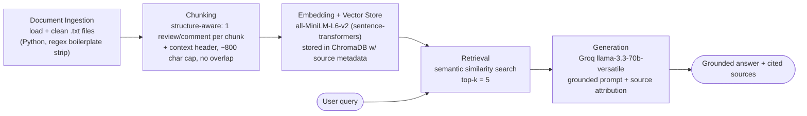

# Project 1 Planning: The Unofficial Guide

> Write this document before you write any pipeline code.
> Your spec and architecture diagram are what you'll use to direct AI tools (Claude, Copilot, etc.) to generate your implementation — the more specific they are, the more useful the generated code will be.
> Update the Retrieval Approach and Chunking Strategy sections if you change your approach during implementation.
> Update this file before starting any stretch features.

---

## Domain

Student reviews of **Computer Science professors at Lakemont University** (a fictional campus).
The system makes searchable the real, student-to-student knowledge about CS courses — teaching
style, exam format, workload, grading leniency, and which professor to take or avoid for a given
course.

This knowledge is valuable because the official course catalog tells you a class's topics and
credit hours but never that Patel's exams are all proofs and analysis, that Okonkwo is the right
first class for someone who has never coded, or that you shouldn't stack OS and ML in one
semester. That information lives scattered across individual reviews and forum threads, is
tedious to search across by hand, and is exactly what a grounded retrieval system can surface
with citations.

> **Corpus note:** the documents are *synthetic* samples modeled closely on Rate My Professors
> review pages and Reddit threads. They were authored for this project because real RMP/Reddit
> content is JavaScript-rendered and blocks scraping, and a fictional university avoids
> publishing negative claims about real people. The pipeline is source-agnostic — real `.txt`
> or PDF files can be dropped into `documents/raw/` later with no code changes.

---

## Documents

12 documents in two deliberately different formats, for structural variety (see
[`documents/SOURCES.md`](documents/SOURCES.md) for the full index).

| #  | Source                                              | Description                                              | URL or location                                   |
|----|-----------------------------------------------------|----------------------------------------------------------|---------------------------------------------------|
| 1  | RateMyProfessors — Prof. Elena Marsh (CS 201)       | Data Structures; tough but fair, exam-heavy              | `documents/raw/rmp_marsh_cs201.txt`               |
| 2  | RateMyProfessors — Prof. David Okonkwo (CS 101)     | Intro to Programming; beginner-friendly, easy A          | `documents/raw/rmp_okonkwo_cs101.txt`             |
| 3  | RateMyProfessors — Prof. Rajesh Patel (CS 310)      | Algorithms; brilliant but disorganized, hard exams       | `documents/raw/rmp_patel_cs310.txt`               |
| 4  | RateMyProfessors — Prof. Sarah Lindqvist (CS 340)   | Operating Systems; heavy workload, great projects        | `documents/raw/rmp_lindqvist_cs340.txt`           |
| 5  | RateMyProfessors — Prof. Michael Brennan (CS 325)   | Databases; easy A, boring lectures, useful SQL           | `documents/raw/rmp_brennan_cs325.txt`             |
| 6  | RateMyProfessors — Prof. Yuki Tanaka (CS 420)       | Machine Learning; demanding, research-heavy              | `documents/raw/rmp_tanaka_cs420.txt`              |
| 7  | RateMyProfessors — Prof. Carla Mendez (CS 230)      | Web Development; project-based, best feedback            | `documents/raw/rmp_mendez_cs230.txt`              |
| 8  | RateMyProfessors — Prof. Thomas Reed (CS 250)       | Computer Architecture; dry but fair, mandatory attendance| `documents/raw/rmp_reed_cs250.txt`                |
| 9  | RateMyProfessors — Prof. Aisha Bello (CS 210)       | Discrete Math; clear proofs, lots of homework            | `documents/raw/rmp_bello_cs210.txt`               |
| 10 | RateMyProfessors — Prof. Gregory Halvorsen (CS 350) | Software Engineering; group project, disorganized        | `documents/raw/rmp_halvorsen_cs350.txt`           |
| 11 | r/LakemontU — "Best CS electives senior year?"      | Thread comparing electives by workload/usefulness        | `documents/raw/reddit_cs_electives_thread.txt`    |
| 12 | r/LakemontU — "Is Patel as bad as people say?"      | Thread on surviving Algorithms / how to prepare          | `documents/raw/reddit_algorithms_prof_thread.txt` |

**Structural variety:** documents 1–10 are review pages where each of ~4 student reviews is a
short (2–5 sentence), self-contained opinion tagged with course number, quality/difficulty
scores, and date. Documents 11–12 are forum threads where a single answer can span an original
comment plus its replies, and facts are spread across a conversation rather than concentrated.
All documents are wrapped in web boilerplate (nav menus, cookie banners, footers) that must be
stripped during ingestion.

---

## Chunking Strategy

**Strategy: structure-aware splitting.** Rather than a blind fixed-character split, the chunker
splits on the natural semantic boundary of each document type — one student review per chunk for
review pages, and one top-level comment (plus its nested replies) per chunk for forum threads.
A short context header is prepended to every chunk so it is meaningful in isolation.

**Chunk size:** one review/comment per chunk — typically **250–550 characters** — with a
**hard cap of ~800 characters**. If a single comment exceeds the cap, it is split at a sentence
boundary so no chunk is dumped mid-word.

**Overlap:** **none (0 characters).** Each review or comment is an independent semantic unit, so
character overlap would bleed one student's opinion into a neighbor's chunk and create
misleading hybrids. Standalone retrievability is achieved instead by **prepending a context
header** — `[Professor Name | Course | Source]` — to each chunk. Example:

```
[Prof. Elena Marsh | CS 201 Data Structures | RateMyProfessors]
"Marsh is hard but genuinely one of the best... Her exams come straight from the
lecture slides, not the textbook. Midterms are curved, the final is not."
```

**Reasoning:** the corpus is dominated by short, opinion-dense reviews where the key fact is
concentrated in a single 2–5 sentence unit. A fixed 500-character split would cut reviews
mid-sentence and merge two unrelated students' opinions into one embedding, diluting the
semantic signal. Whole-document chunks (one professor page each) would average four different
topics — exams, workload, office hours, the curve — into one vector that matches no specific
query well. Splitting on the review boundary keeps each chunk to one coherent thought; the
header preserves *who/what* the opinion is about, which is the single most important retrieval
signal for queries like "how are Marsh's exams." Overlap is unnecessary precisely because we
are not splitting continuous prose where a fact could straddle a boundary.

**Expected chunk count:** ~10 review pages × ~4 reviews + 2 threads × ~5–8 comments ≈ **50–60
chunks**, comfortably inside the guide's healthy 50–2,000 range.

---

## Retrieval Approach

**Embedding model:** `all-MiniLM-L6-v2` via `sentence-transformers`. It runs locally with no API
key or rate limits, produces 384-dimensional vectors, and handles ~256 tokens per input — our
header-plus-review chunks fit comfortably under that limit. It is fast enough to embed the whole
corpus in seconds on a laptop.

**Top-k:** **5.** Most questions target a single professor who has ~4 reviews, so k=5 retrieves
enough on-topic reviews for the LLM to synthesize a grounded answer without pulling in much
unrelated material. Too few (k=1–2) risks missing the review that actually answers the question;
too many (k=10+) dilutes the context with loosely related chunks that can pull the answer
off-target. k=5 will be re-tuned in Milestone 4 against real distance scores.

**Production tradeoff reflection:** if this were deployed for real users and cost were not a
constraint, I'd weigh:
- **Accuracy on domain text** — a larger model (e.g. `all-mpnet-base-v2` or an OpenAI/Cohere
  hosted embedding) would distinguish near-synonyms better ("curved" vs "lenient grading") at
  the cost of latency and, for hosted models, per-query API spend.
- **Context length** — MiniLM's ~256-token cap is fine for short reviews but would truncate
  long-form guides or syllabi; a long-context embedding model matters if the corpus grows toward
  multi-page documents.
- **Multilingual support** — MiniLM is English-centric. If reviews appeared in multiple
  languages, a multilingual model (e.g. `paraphrase-multilingual-MiniLM`) would be required.
- **Local vs. API** — local keeps data private (student reviews can be sensitive) and removes
  rate limits and recurring cost, at the price of lower ceiling accuracy and self-hosting
  effort. For this domain I'd lean local even in production for the privacy alone.

---

## Evaluation Plan

| # | Question | Expected answer |
|---|----------|-----------------|
| 1 | What do students say about Professor Marsh's exams in CS 201? | Exams come from the lecture slides, not the textbook; midterms are curved but the final is not; attendance/keeping up with problem sets matters more than the readings. |
| 2 | Which CS professor is best for someone who has never programmed before? | Professor Okonkwo (CS 101 Intro to Programming) — gentle pace, patient with beginners, clear rubrics, lots of partial credit; the recommended first CS class for a non-coder. |
| 3 | How should I prepare for CS 310 Algorithms with Professor Patel? | Do every practice problem he posts (exams are variations of them); take Discrete Math (Bello, CS 210) first because his exams are proof- and analysis-heavy; form a study group; expect disorganization (late grades, shifting dates) but a generous end-of-term curve. |
| 4 | Which two CS classes should I avoid taking in the same semester? | Operating Systems (Lindqvist, CS 340) and Machine Learning (Tanaka, CS 420) — students warn both are ~20-hour-per-week workloads and shouldn't be stacked. |
| 5 | Which CS professor has the highest "would take again" rating? | Professor Okonkwo at 94% (the highest of the ten professors in the corpus). |

**Notes on question design:**
- Q1 and Q2 are single-professor questions whose answer is concentrated in a few reviews — these
  should pass cleanly and validate the happy path.
- Q3 and Q4 require synthesizing across two documents (a review page **and** a Reddit thread, or
  two different reviews) — these test whether retrieval surfaces all the relevant pieces.
- **Q5 is a deliberately hard question expected to fail.** Answering it correctly requires
  ranking a numeric metadata field ("would take again %") across *all ten* professor pages.
  Semantic top-k retrieval returns the chunks most similar to the query text, not a global
  maximum, so the model is unlikely to see all ten values and cannot reliably compute the max.
  This exposes a fundamental limitation of vanilla RAG: it does retrieval, not aggregation.

---

## Anticipated Challenges

1. **Boilerplate noise surviving cleaning.** Every source is wrapped in nav menus, cookie
   banners, "Submit a Correction" links, social-share text, and footers. If cleaning is
   incomplete, this junk gets embedded alongside real content, lowering similarity scores and
   occasionally surfacing as a "top" chunk that is actually a footer. Mitigation: strip known
   boilerplate patterns during ingestion and manually inspect one cleaned document before
   chunking (Milestone 3 checkpoint).

2. **Aggregation / ranking queries (the Q5 failure mode).** Questions of the form "which
   professor has the highest/lowest X" or "how many professors are exam-heavy" require reasoning
   over the whole corpus, but semantic retrieval only returns the top-k *most similar* chunks.
   The system will likely return a plausible-but-wrong answer based on whichever pages happened
   to be retrieved. This is inherent to retrieval-only RAG and is documented as the project's
   honest failure case rather than hidden.

3. **(Secondary) Cross-document synthesis gaps.** For Q3/Q4 the full answer is split between a
   review page and a forum thread. If top-k pulls chunks from only one source, the answer will
   be partial. This is the main reason k is set to 5 rather than 2–3, and a candidate for tuning.

---

## Architecture



Pipeline stages: **Document Ingestion → Chunking → Embedding + Vector Store → Retrieval →
Generation.** Each chunk carries metadata (`source` filename, `professor`, `course`,
`chunk_index`) from ingestion through to generation so the final answer can cite which
document(s) it drew from.

---

## AI Tool Plan

**Milestone 3 — Ingestion and chunking.**
Tool: Claude. Input: the **Documents** and **Chunking Strategy** sections above plus the
architecture diagram. I'll ask it to implement `load_documents()` (read every `.txt` in
`documents/raw/`), `clean_document()` (strip the specific boilerplate present in our sources —
the `RateMyProfessors.com | Home | ...` nav line, the cookie notice, `[ Load more reviews ]`,
the `Footer: ...` block, and HTML entities), and `chunk_document()` implementing structure-aware
splitting on the review/comment boundary with the `[Professor | Course | Source]` header and the
~800-char cap. Verify: print one cleaned document to confirm no nav/footer text remains, and
print 5 chunks to confirm each is a self-contained review with its header and correct metadata.

**Milestone 4 — Embedding and retrieval.**
Tool: Claude. Input: the **Retrieval Approach** section and the diagram. I'll ask it to embed all
chunks with `all-MiniLM-L6-v2`, store them in ChromaDB with the metadata fields above, and write
`retrieve(query, k=5)` returning chunks plus distance scores and source info. Verify: run test
questions Q1–Q3 from the Evaluation Plan, print returned chunks and distances, and confirm the
top results are on-topic with distances below ~0.5 before adding generation. I'll ask Claude to
explain any ChromaDB API call I don't recognize rather than accepting it blindly.

**Milestone 5 — Generation and interface.**
Tool: Claude. Input: the grounding requirement (answer **only** from retrieved chunks; refuse
with "I don't have enough information on that" when the context doesn't cover the question),
the desired output format (answer text + a programmatically appended source list), and the
Gradio skeleton from the assignment guide. I'll review the generated system prompt to confirm it
*enforces* grounding rather than merely suggesting it, and confirm source attribution is built
from the retrieved chunks' metadata in code — not left to the LLM to invent. Verify: run a
grounded query, a cross-document query, and an out-of-scope query to confirm the refusal path
works.
